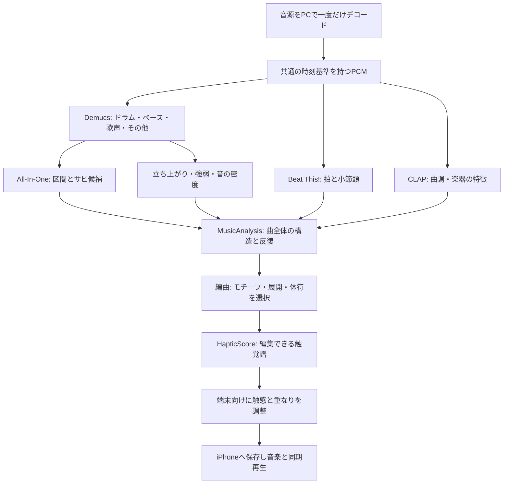

# 音楽を理解して振動パートを編曲するための調査・設計

調査日：2026年10月7日。対象：Reson、Core Haptics対応iPhone、PCでの事前解析。

**目標は、既存の曲に「触覚で演奏する楽器」を追加すること。** 音楽の構造・グルーヴ・曲調を推定し、曲全体で一貫した振動モチーフ、展開、休符を設計する。iPhoneの高速解析は新しい生成経路から廃止する。初回の処理時間より、編曲としての質を優先する。

初期実装を追加し、指定された[なとり「Serenade」](https://www.youtube.com/watch?v=gNg2Qw5R-Q4)の全曲を、このPCで実際に解析・編曲した。[検証記録](verification/SERENADE.md)に時刻、測定値、AHAP、図を保存している。XcodeビルドとiPhoneの触感評価は未実施。以下には初期の設計案と将来の拡張も含む。編曲ルールや閾値は本プロジェクトの設計で、研究で確立された最適値ではない。

## 初期実装の範囲

- `arrangement-3.3`では、複数拍の時刻の直線近似でテンポを推定する。一対一の拍照合、局所周期・小節長の整合性判定、別モデルで裏付けた重複拍の除去を追加した。ドラムのオンセットから16分シャッフルを推定し、支持のある区間で細分音符の位置を変える。原曲137 BPMや全曲4/4を固定しない。[改善の検証](verification/SERENADE-IMPROVED.md)。
- `music_ai.py`: HTDemucs → All-In-Oneの8-fold合成 → Beat This → CLAPを順番に動かし、ステム・曲構造・拍・固定属性との類似度を解析する。
- Windowsでは[All-In-Oneの移植版](https://github.com/openmirlab/all-in-one-infer/tree/8414233b743d6ccec46e36ab4cfeddb4605ff3bf)をコミット固定で使用する。元の学習済み重みを使い、NATTEN/madmomの実行部分を移植版に置き換える。元実装との数値一致はこのプロジェクトでは未検証。WSLは不要。
- `haptic_arrangement.py`: 観測された拍・小節を使い、サビのモチーフ系列を共有し、楽器の強弱・歌との重なり・負荷からbeam searchで音符と休符を選ぶ。拍や小節頭が食い違う箇所では持続のフレーズへ切り替える。編曲器自体は学習モデルではない。
- version 3は編曲した持続強度を直接保存し、再生時に低音の強度へ再変換しない。持続とアクセントは独立プレーヤーで再生する。曲の区間表示とレイヤー別調整を追加した。
- サンプルは最大4レイヤー、AHAPの`Event`/`Parameter`/`ParameterCurve`の入出力、合成音との同期に対応。外部音声を参照する`AudioCustom`は今回のインポート対象外。[対応範囲](AHAP.md)。
- 新規作成はPCのAI編曲へ変更した。旧保存曲は再生でき、旧端末解析は互換性・内部テスト用に残す。APIはprotocol 1へ能力情報とversion 3を追加し、旧クライアントのDSPリクエストを維持した。
- 未実装の拡張は、人手注釈での正解率評価、iPhone実機での比較、譜面編集UI、個人の好みによる学習、SongFormer比較、切断後のジョブ復帰である。

## 1. 推奨する構成

最初の実装は **All-In-One + Demucs + Beat This! + 音楽用CLAP + 独自の編曲エンジン** とする。解析は利用者のPCで行い、iPhoneへ完成した触覚譜と再生データを保存する。保存後の再生にはPCを必要としない。

開発環境で **RTX 3050、VRAM 8,192 MiB** を確認した。Python 3.11とCUDA 12.4のPyTorchを独立した環境へ導入し、Windows上で直接動作させた。モデルを順番に動かし、分離したステムを構造解析と特徴抽出で共有する。

SongFormerは構造解析の有力な比較候補。ただし、長い文脈を使う処理のメモリと、依存するMuQの公開重みの非商用条件を検討してから採用を決める。名前の新しさだけで、現在のPCで動くことやJ-POPでの優位性を保証しない。



All-In-One自身がDemucsを呼ぶので、別途同じ音源を分離し直さない。分離済みファイルをキャッシュし、構造解析と編曲特徴の抽出で共有する。現行の `allin1` は所定のディレクトリに4種類のステムがあると分離を省略する。これは[公式のdemix実装](https://raw.githubusercontent.com/mir-aidj/all-in-one/main/src/allin1/demix.py)で確認した。

## 2. 「曲のコンセプトを理解する」の具体化

初期版が推定するのは次の4層とする。

| 層 | 推定するもの | 編曲への使い方 |
| --- | --- | --- |
| 曲の形式 | intro / verse / chorus / bridge / outro、区間境界、繰り返し | サビでモチーフを再登場させ、区間の移行を演出する |
| リズム | 拍、小節頭、局所テンポ、実際の打音、シンコペーション | 音源のグルーヴに合う位置で触覚を演奏する |
| 表情 | 穏やか、激しい、明るい、暗い、緊張感、広がりなどの傾向と変化 | 密度、触感、長さ、余白の配分を変える |
| 楽器の役割 | ドラムの打音、ベースの支え、歌声のフレーズ、その他の持続音 | どの役割を振動に受け持たせるか選ぶ |

作者の意図、歌詞の意味、物語の解釈は、この音響解析だけでは確定しない。初期版での「コンセプト」は、音として観測できる曲調と展開を指す。「切ない」などの推定が曖昧でも、拍・反復・フレーズ・強弱から編曲できる構成にする。

CLAPの音声・テキストの類似度は、意味の正解確率ではない。固定した英語の短い属性文を事前に埋め込み、曲の区間との類似度を比較する。文章を生成・推論するLLMは使わない。テキストエンコーダを使う対照学習モデルと、対話型LLMは区別する。

## 3. 調査開始時の実装との差分

| 現行コード | 実際の処理 | 新設計での位置づけ |
| --- | --- | --- |
| `HapticLab/MusicAnalyzer.swift`、`MusicPrecisionAnalysis.swift` | FFT、帯域エネルギー、立ち上がりから振動を作る | 新規の標準生成経路から外す。周波数表示などに必要な部品は切り分ける |
| `HapticLab/MusicComposer.swift` | 打音間隔からBPMを推定し、一定間隔の拍へアクセントを配置。4拍単位を仮定 | 実際の拍列、反復構造、フレーズに基づくPC編曲へ置き換える |
| `pc-server/signal_analysis.py` | NumPyのFFT、閾値による打音検出、一定BPMの拍列。`beats[::4]` を小節頭とする | 音響特徴の一部を再利用。簡易拍推定を新しい拍追跡へ置き換える |
| `pc-server/worker.py` | 解析と簡易な仕上げ、version 2の振動JSON保存 | モデル解析、編曲、端末向け生成を独立した段階に分ける |
| `HapticLab/MusicModels.swift` | `bass`・`energy`などを再生時に強度へ変換。version 1〜2のみ検証 | 完成した編曲をそのまま再生できるversion 3を追加する |
| `HapticLab/MusicPlayback.swift` | メディア時計に合わせて短いパターンを先行予約。停止・シーク・速度変化へ追従 | 同期の仕組みを継続し、version 3のパターンを扱えるようにする |

調査開始時のPCサーバーはNumPy、FFmpegの補助、yt-dlpだけだった。今回追加したML環境と`music_ai.py`がニューラル解析を担い、旧FFTは周波数表示と旧API互換用に使う。

FFTを細かくしても、サビの役割や曲全体の展開を推定する処理は増えない。今回の変更は解析の解像度を上げるだけではなく、**解析結果から触覚譜を編曲する段階を追加する変更**になる。

## 4. モデル・アルゴリズムの選定

| 候補 | 一次資料で確認できた機能・条件 | 採用判断 |
| --- | --- | --- |
| [All-In-One](https://github.com/mir-aidj/all-in-one) | 拍、小節頭、区間境界、verse / chorusなどのラベルを同時推定。4ステムを入力に使う。コードはMIT。WindowsではNATTENなどの導入が必要 | 初期の構造解析。`harmonix-all` を品質基準に比較する。拍の正本はBeat This!に統一する |
| [Beat This!](https://github.com/CPJKU/beat_this) | 拍・小節頭の推定。コードと公開重みはMIT。Pythonで推論でき、`dbn=False` を選べる | `final0` を初期候補とする。全曲一定BPMの仮定をやめ、時刻の列を使う |
| [Demucs](https://github.com/adefossez/demucs) | ドラム、ベース、歌声、その他の分離。コードはMIT。元のMetaリポジトリはアーカイブ済みで、作者のフォークがある | All-In-Oneと互換性を確かめた `htdemucs` を固定し共有。分離結果の強弱と打音を利用する |
| [音楽用CLAP](https://huggingface.co/laion/larger_clap_music) | 音楽向けに学習した音声・テキストの埋め込みと類似度。モデルカードのライセンスはApache-2.0 | 曲調の補助信号として採用。曲全体を1ベクトルへ潰さず、区間内の複数窓で集約する |
| [SongFormer](https://github.com/ASLP-lab/SongFormer)、[論文](https://arxiv.org/abs/2510.02797) | MuQとMusicFMの短い・長い文脈を融合して構造を推定。著者のベンチマークでは高い境界・ラベル精度。コードはCC-BY-4.0 | All-In-Oneとの比較候補。正式採用は8GBでの実測、長い曲の扱い、依存重みの条件を確認して決定する |
| [MuQ / MuQ-MuLan](https://github.com/tencent-ailab/MuQ) | 音楽特徴、音楽と英語・中国語テキストの埋め込み。入力24 kHz。コードMIT、公開重みCC-BY-NC-4.0 | 個人・非商用の品質比較候補。配布や商用利用を含む構成では、コードのMITだけで判断しない |
| [MERT](https://huggingface.co/m-a-p/MERT-v1-95M) | 音楽用の事前学習特徴。公開重みCC-BY-NC-4.0 | 将来の専用属性ヘッドの候補。特徴抽出だけでサビ判定や触覚編曲が完成するとは扱わない |
| [反復グラフ・Laplacian segmentation](https://librosa.org/doc-playground/latest/auto_examples/plot_segmentation.html) | 拍に同期した和声・音色の特徴と反復グラフから構造を求める公開実装 | 同じサビ・似たフレーズを結びつける補助。形式ラベルが曖昧な曲ではsection A / Bとして利用する |

All-In-Oneのラベルにはpre-chorusが含まれない。Bメロやサビ前の高まりを、存在しないモデル出力として扱わない。初期版では `transition` という編曲上の状態を、区間間の変化と次の区間から導く。SongFormerの公式推論設定ではpre-chorusを含む8クラスを扱うことを[ラベル定義](https://raw.githubusercontent.com/ASLP-lab/SongFormer/main/src/SongFormer/dataset/label2id.py)で確認した。ただし日本語のAメロ・Bメロへの対応は一対一ではない。

SongFormerの[公式推論コード](https://raw.githubusercontent.com/ASLP-lab/SongFormer/main/app.py)は、420秒と30秒の表現を計算する。8GBで長い曲が収まるかは未確認であり、全曲を単純に短い窓へ分割すると長期構造の利点が変わる。その場合は別の構成として評価する。SongFormer自身のコードがCC-BYでも、利用するMuQ重みの非商用条件は別に確認する。

All-In-Oneが使うmadmomにもコードと重みで異なる条件がある。[madmomのライセンス](https://github.com/CPJKU/madmom/blob/master/LICENSE)ではモデル・データがCC-BY-NC-SA。初期構成ではBeat This!のDBNを無効にし、madmomの学習済み重みを追加しない。All-In-Oneの[スペクトログラム処理](https://raw.githubusercontent.com/mir-aidj/all-in-one/main/src/allin1/spectrogram.py)など、実際に使う依存と各重みの条件を個別に記録する。

### 振動生成AIをそのまま採用しない理由

[Sound2Hap](https://arxiv.org/abs/2601.12245)は、人の評価を使って環境音から振動を学習する研究。楽曲のサビや数分間の編曲を扱うモデルとして評価されたものではない。[HapticGen](https://hapticgen.hcitech.org/)はテキストから振動を作る研究。[AudioHapticDiffusion](https://aratahorie.com/research/audiohapticdiffusion/)はテキストから効果音と広帯域アクチュエーター用の振動を同時生成する研究である。

この調査で確認した範囲では、既存のフル楽曲を理解し、iPhone向けの触覚パートを曲全体で編曲する完成済みモデルは確認できなかった。これらは将来の触感生成・学習方式の参考にし、初期の編曲エンジンは専用に設計する。

## 5. 音楽解析の出力

解析結果を `MusicAnalysis` として保存する。最終的な振動と分離しておけば、編曲の変更だけなら音源の再取得やモデル推論を繰り返さずに済む。

| データ | 保存する内容 |
| --- | --- |
| 音源の識別 | 元ファイルSHA-256、canonical PCMのハッシュ、デコーダ版、長さ、YouTube IDなどの参照 |
| 時刻基準 | 元の再生メディアに対する秒。デコード時の先頭オフセットと無音を保持 |
| 拍 | 拍・小節頭の時刻列、局所テンポ、利用モデル、品質指標。拍子が不明ならnull |
| 区間 | start / end、ラベル候補、モデルの生スコア、校正済み信頼度があればその値 |
| 反復 | 類似区間のgroup ID、対応するフレーズ、再登場の順番 |
| 楽器の特徴 | ステム別の立ち上がり、強弱、密度、歌声の活動、持続音の変化 |
| 曲調 | 属性ごとの類似度、区間内での変動、推定が曖昧かどうか |
| 出所 | モデル・重みの版とハッシュ、設定、実行時間、使用メモリ、劣化や警告 |

デコードは一度だけ行う。ステレオ44.1 kHzの基準PCMから各モデルが要求する入力を作り、リサンプル後も元の秒へ戻す。左右の逆相で音が消える場合に備え、振動用のエネルギーは左右別に計算して集約する。学習済みモデルの前処理はそのモデルの仕様に合わせ、独自に変更した場合は比較対象として明示する。

Beat This!の最終時刻列だけで正解確率が得られるとは扱わない。必要ならフレーム出力と拍の連続性などを品質指標に使う。softmaxや類似度をそのまま「確信度90%」として表示せず、検証用の曲で校正するまでは `rawScore` と `confidence: null` を使う。

反復の検出には拍同期のchromaと音色特徴を用い、候補区間同士の並びを比較する。同じコード進行だけを同じサビと決めない。歌声・編成・リズムの一致も参照し、静かなサビ、冒頭サビ、一度しかないサビを否定しない。「音量が最大の区間」をサビの定義にしない。

区間境界は構造モデルの推定時刻と、編曲で使う時刻を分けて保持する。近くの小節頭・編成変化・立ち上がりが支持する場合にだけ補正し、全ての境界を最寄りの拍へ強制的に寄せない。PCのタイムラインでサビの範囲などを修正できるようにし、修正をモデルの元出力とは別に保存する。修正後は構造解析をやり直さず、編曲以降だけを再生成する。

ドラムステムには複数の打楽器が残る。初期版の分類は低い打音／中高域の打音などの粗い役割とし、キック・スネアの完全な採譜を保証しない。必要になってから専用の打楽器認識・採譜モデルを追加する。

## 6. 触覚パートを編曲する

編曲を **曲全体の計画 → フレーズの選択 → 音符と触感の具体化** の3段階に分ける。

### 曲全体の計画

曲調、区間の役割、音の密度、繰り返しから、その曲の基本的な触感とモチーフを決める。主役は「リズムを支える」「フレーズを持続感で支える」「転換点を強調する」のいずれかを中心とし、区間ごとに配分を変える。

たとえば、静かなバラードでは柔らかい短い持続と少ないアクセントを中心にする。ダンス曲では低い打音と小節頭のグルーヴを中心にする。激しい曲でも全ての音へ振動を足さず、重要な打音と区間の節目を選ぶ。この対応は編曲仮説として比較評価する。

同じサビには、同じリズムの骨格と触感を再登場させる。2回目では末尾だけを変えるなど、元曲の変化に応じた変奏を作る。最終サビを無条件に最大強度にせず、曲の編成・表情・盛り上がりがそれを支える場合に展開する。

### フレーズの選択

最初は人が設計した小さなモチーフ集合を使う。単発アクセント、長短の対、控えめな裏拍、柔らかい支え、短い上昇、休符などを組み合わせる。確かな小節情報がある箇所では2〜4小節の候補を作り、情報が曖昧なら音のフレーズと秒単位の変化を使う。

候補の評価は次の形にする。各重みは人の比較評価から調整し、初期値を学習済みの正解として扱わない。

```text
編曲スコア = リズムへの一致
           + 区間の役割への一致
           + 主役となる音・フレーズへの一致
           + 再登場するモチーフの一貫性
           + 曲調と触感の適合
           - 不要な振動の密度
           - 触感同士の競合
           - 連続した強い振動
```

単純な「その瞬間で最も強い音」の選択を越えて、前後のフレーズを含めて候補列を選ぶ。初期は動的計画法／beam searchで、フレーズ境界の自然さ、反復区間のモチーフ共有、区間別の密度目標を扱う。曲全体で共有するモチーフを先に決め、局所探索では変奏と強度を選ぶ。

### 音符と触感の具体化

| 仮想的なパート | 主な材料 | 触覚としての演奏 |
| --- | --- | --- |
| Pulse | ドラムの打音、拍、小節頭 | 短いタップ。グルーヴを支える |
| Body | ベース、持続音、フレーズの強弱 | 必要な箇所だけ柔らかい持続。常時鳴らさない |
| Accent | 区間頭、重要な打音、フレーズ終端 | 主役のアクセントや短い終止 |
| Transition | 次の区間、音の増減、編成変化 | 短い高まり、減衰、休符から次へ入る動き |

これらは論理的なパートであり、iPhoneに4個の独立した振動子があるという意味ではない。最後に単一の触覚出力へ整理する。

打音を使う音符は、検出された実時刻を保持する。拍グリッドは所属やフレーズを判断するために使い、スウィングや演奏の微妙なずれを全部等間隔へ丸めない。新しく加える補助音だけを、その場所の拍間隔に合わせて配置する。3拍子、変拍子、テンポ変化へ4拍の型を強制しない。

音の明るさを鋭さへ直結させず、曲全体の基本触感、パートの役割、局所の音色から穏やかに変化させる。全曲で共通の音量基準を保ち、区間ごとに静かな音を最大へ正規化しない。無音区間では出力をゼロにする。

### 1曲での編曲例

以下は架空のポップスの例。サビというラベルだけで強度を上げるのではなく、実際の強弱と編成も使う。

| 元曲の展開 | 追加する振動パート |
| --- | --- |
| イントロ | 特徴的なリズムを少数の柔らかいタップで提示 |
| Aメロ | モチーフの一部を省き、歌声のフレーズの間に余白を作る |
| サビ前 | 次の区間へ向けた短い持続と、直前の休符。予測が弱ければ控えめにする |
| サビ | イントロのモチーフを展開し、重要な打音とフレーズ頭を明確にする |
| 2回目のサビ | 同じ触覚モチーフを再登場させ、元曲の変化に合わせて末尾を変奏 |
| ブリッジ | リズム中心から柔らかい持続へ比重を移すなど、役割を変える |
| 最終サビ〜アウトロ | 元曲の展開に応じて広がりを出し、終止と余韻で閉じる |

## 7. iPhoneへ出す触感

Core Hapticsでは、短いtransientと時間を持つcontinuous、強度、鋭さを組み合わせる。[AppleのCore Haptics解説](https://developer.apple.com/videos/play/wwdc2019/520/)はこの表現を説明し、鋭さを柔らかい感触から明確な感触への知覚的な軸として扱っている。

そのため、任意の振動PCMや音程をそのまま再生する設計にはしない。メロディーを扱う場合も、まずリズム、抑揚、フレーズの輪郭を触覚へ表現する。鋭さの値を楽器の音高Hzとして扱わない。

触覚譜を生成した後に、端末向けのコンパイラを通す。

- 同時刻の候補には優先順位を付け、支えの持続音を弱めて主役のタップを残す。
- 近すぎるタップは統合・選別する。初期比較値は最短間隔80〜120 msだが、テンポと触感に応じて検証する。
- 強度・鋭さを0〜1へ制限し、強い出力が長く続く場合は配分を見直す。
- 曲の静かな箇所、フレーズ終端、休符を保持する。連続感は余白との組み合わせで作る。
- カーブを近似して制御点を削減し、現行のパターン検証・端末の制約に収まる短い単位へ分割する。
- スマホの機種・持ち方・ケースによる違いを実機で比較し、少数の端末プロファイルで調整する。

合成の強度予算は知覚上の指標として使う。2つのイベントの強度値を足せば、物理的な振幅や感じる強さがその通りになるとは仮定しない。複数のcontinuousを無制限に重ねず、支えの出力を整理してから、transientとの競合を評価する。

## 8. 保存形式と互換性

保存するものを3つに分ける。

| 形式 | 主な内容 | 保持する場所 |
| --- | --- | --- |
| `MusicAnalysis` schema 1 | 構造、拍、反復、楽器特徴、曲調、出所 | PC。編集・再編曲に必要な集約特徴は保持 |
| `HapticScore` schema 1 | モチーフ、各音符の役割、触感、音楽上の位置、変奏の判断 | PC。iPhoneには必要な要約を渡す |
| `MusicHapticTrack` version 3 | 完成したcontinuous強度・鋭さ、taps、区間表示、再生用メタデータ | PCとiPhone |

新形式では、`continuous` は `time / intensity / sharpness` の制御点を持つ。`taps` は `time / intensity / sharpness` を持つ。無音だけの曲も、ゼロのcontinuousを持つ有効なトラックとして表現できるようにする。

**version 3は、現行の `bass`・`energy` から再度強度を作る経路を通さない。** 完成した編曲へ既存の係数をもう一度掛けると、狙った強弱が失われる。`MusicHapticTrack.validated()`、`segment()`、`output()` と表示を同じ新データへ対応させる。既存version 1〜2は従来の処理で読み込めるように残す。

現行の `MusicAnalysisInfo` は1つのsampleRate、hopMilliseconds、fftSizeを必須にしている。複数モデルを使うversion 3では段階ごとのmanifestへ移し、完成した振動を読むために1つのFFT設定を必須にしない。このversion 3はアプリ独自の保存形式であり、AHAPのVersionとは別である。

触覚譜の音符1個は、たとえば次のように表せる。これは説明用の部分データであり、現行アプリへ読み込むJSONではない。位置は保存済みの拍配列を参照し、絶対時刻を正本にする。

```json
{
  "schemaVersion": 1,
  "note": {
    "id": "chorus-2-pulse-03",
    "sectionId": "chorus-2",
    "motifId": "main-pulse",
    "layer": "pulse",
    "gestureId": "rounded-hit",
    "timeSeconds": 72.53,
    "beatIndex": 145,
    "offsetFromBeatSeconds": 0.03,
    "intensity": 0.55,
    "sharpness": 0.25,
    "sourceRole": "low-drum-onset"
  }
}
```

再生時の即時調整は全体の強度、持続／タップの比率、同期補正を中心にする。「密度」は強度閾値で機械的に音符を消す方法から、譜面上の優先順位を使う方法へ変える。初期版では同じ解析から「控えめ／標準／豊か」の3種類を作成し、モチーフの骨格を残した状態で選べるようにする。

キャッシュは、音源のハッシュ、デコーダ、モデル重み、解析設定、編曲版、端末プロファイルから作る。YouTube IDは参照・索引に使い、完全な音源の同一性の証明には使わない。モデルを変えた結果が旧キャッシュから返らないよう、解析と編曲のキーを分離する。

取得音源やステムは、必要な特徴を保存した後に削除する。モデル重みと解析済み特徴は再利用する。再編曲だけならそれらの特徴から作成し、別の音楽解析モデルを試す場合は音源を再取得・再指定する。

## 9. PCサーバーとアプリの変更

### PC側

既存の認証付きジョブAPIと1ジョブずつの処理を入口に使う。Windows上のHTTPサーバーとML環境を分離し、MLワーカーは当初WSL2のLinux環境を候補とする。元のAPI用NumPy環境へ、異なる依存条件のモデル群を一括追加しない。

All-In-OneはNATTENとmadmomの導入が必要で、SongFormerの[公式依存ファイル](https://raw.githubusercontent.com/ASLP-lab/SongFormer/main/requirements.txt)にもNumPy・PyTorch・Tritonなどの固定条件がある。最小の推論環境で互換性を確認し、動作した版と重みを固定する。研究用の学習・Gradio・評価の全依存を、PC APIへそのまま持ち込まない。

WindowsのジョブフォルダーからLinux側の作業領域へ音源を渡し、Linux側で重いI/Oを行う。完成結果と状態だけをジョブフォルダーへ原子的に返す。外部に新しい公開サーバーを作る必要はない。

処理状態は次のように分け、完了済みの段階を再利用できるようにする。

```text
queued → acquiring → decoding → separating → structure
       → rhythm → expression → arranging → compiling → completed
```

キャンセルと失敗は別の終端状態。GPU不足なら段階単位で再試行する。曲調解析だけ失敗した場合はその事実を保存し、構造とリズムを使って編曲を完了できる。構造ラベルが曖昧な場合はsection A / B、拍が曖昧な場合はフレーズ中心へ移る。旧iPhone高速解析へ自動的に戻す動作は追加しない。

プロトコルは2へ更新し、`health` に対応トラック版、モデルの準備状況、実行デバイスを返す。現在のiPhoneクライアントは `protocolVersion == 1` を要求するので、サーバーとアプリを同時に対応させる。HTTPの版と触覚JSONのversion 3は別の番号として管理する。

ジョブ状態には `stage`、`updatedAt`、結果参照を加える。iPhoneが画面を閉じてもPCが続行し、復帰後にjob IDから再開する。現行クライアントの約30分のポーリング回数を、重い解析の中断条件にしない。通信のタイムアウトとジョブ自体の寿命を分ける。

### iPhone側

新規作成は設定済みPCへ送る。「高速／精密」というiPhone解析の選択を新規の生成画面から除き、「振動を編曲して保存」という操作にする。保存済みの曲は従来どおり開いて再生する。PCが使えない場合はジョブ作成を待機・再試行できる状態にし、別の品質の振動を黙って作らない。

`MusicAnalysisQuality.standard` の新規利用を廃止し、古い保存設定の読み込みは移行用として扱う。iPhone精密解析も新しい標準生成経路から外し、比較用に残す場合は開発用の入口へ分離する。

既存version 1〜2の保存曲を削除しない。新方式を適用する場合は「振動を作り直す」で作成し、新しいトラックの検証・保存が成功してから差し替える。

### 変更するファイルと新しい部品

| 対象 | 変更・追加する責務 |
| --- | --- |
| `pc-server/worker.py` | 各段階の実行、キャッシュ、進捗、キャンセル、結果保存 |
| 新規 `music_analysis.py`、`model_adapters/` | 共通PCMと各モデルの境界、MusicAnalysis出力 |
| 新規 `structure_graph.py` | 反復区間、フレーズ対応、曖昧な構造の扱い |
| 新規 `haptic_arranger.py` | 曲全体の方針、モチーフ、候補列の選択、HapticScore |
| 新規 `haptic_compiler.py` | 端末プロファイル、競合の解決、version 3生成 |
| `pc-server/server.py`、`docs/api/openapi.json` | プロトコル2、能力情報、再取得できるジョブAPI |
| `HapticLab/PCAnalysis.swift`、`MusicLibrary.swift` | PC生成、ジョブ復帰、設定移行、原子的な差し替え |
| `MusicModels.swift`、`MusicPlayback.swift`、表示 | version 3の検証、再生、同じ出力の可視化 |
| `MusicView.swift`、解析設定画面 | 生成操作と進捗、端末解析の選択の整理 |
| `README.md`、`MUSIC.md`、`PC-SERVER.md` | 実装後の導入条件と作成手順へ更新 |

## 10. RTX 3050・8GBでの実行設計

分離、構造、拍、曲調のモデルを同時にGPUへ載せない。段階ごとに出力をCPU／ディスクへ保存し、モデルを解放する。全曲の構造を保持することと、全モデルを同時に常駐させることは別である。

Demucsは初期比較で `htdemucs`、`segment=4`、`shifts=0`、`jobs=1` を試す。これは8GB向けの比較設定であり、音質・検出精度は通常設定とも比較する。分離したステムをAll-In-Oneの入力へ再利用するため、All-In-Oneが分離を再実行しないことを確認する。CLIのステム別自動スケールを編曲上の相対音量として誤用せず、同じ基準で解析できるAPI出力や共通スケールを用いる。

実装では通常の`htdemucs`、`shifts=1`、overlap 0.25、FP32で実行できたため、短いsegmentへの変更は行わなかった。Python/NumPy/PyTorchの乱数seedを固定し、モデルrevisionとcheckpointのSHA-256を記録する。ステムの特徴は各楽器の曲全体の95パーセンタイルで正規化し、楽器間の絶対音量比とは扱わない。

All-In-Oneの8モデル合成がメモリに収まらなければ、モデルを逐次評価して生の予測を集約するアダプタを検討する。1モデル版へ切り替える場合は別の解析構成として記録・評価する。SongFormerは最初から常用せず、30秒、3〜5分、7分超の入力でピークVRAM・RAMと区間判定を測る。

設計上の最初の目標は、現在のGPUでピークVRAMを約6.5GB以内に抑え、1曲ずつ安定して解析すること。実際の空きVRAMに応じて余裕を確保する。これは未検証の目標であり、処理が必ず収まるという保証ではない。

処理時間は段階別に測る。指定曲217.74秒では、重み取得後の新規解析・編曲は約47秒、同一音源・モデル・設定の再利用は約4秒だった。これは1曲・このPCでの測定で、一般の曲への速度保証ではない。[全測定値](verification/serenade-metrics.json)。

## 11. 検証と実装の順序

| 段階 | 完成させるもの | 次へ進む条件 |
| --- | --- | --- |
| 0. 評価用の曲と触感 | 自分で解析できる音源、サビ／拍の人手注釈、8〜12種類程度の基本触感 | 同期と、各触感の区別をiPhone実機で確認する |
| 1. PC音楽解析 | Demucs、All-In-One、Beat This!、共通時刻、MusicAnalysis | 全曲で時刻がずれず、実行環境とピークメモリを記録できる |
| 2. 構造を使う編曲 | 反復グラフ、モチーフ、休符、HapticScore、version 3再生 | 旧方式と比較して構成を感じやすく、疲れにくいか実機で判断する |
| 3. 曲調を反映 | CLAPの属性、曲調に応じた触感と役割選択 | 曲調なしの編曲から改善するか確認し、属性依存の失敗を記録する |
| 4. 新規作成の移行 | iPhone高速解析の廃止、PCジョブ復帰、保存曲の互換性 | 旧保存曲、停止・シーク・速度変更、サーバー切断で壊れない |
| 5. 品質向上 | SongFormer比較、人が修正した触覚譜、候補への好みの評価 | 改善が再現するモデル／編曲だけを採用する |

評価にはJ-POP、静かなサビの曲、冒頭サビ、ダンス曲、ロック、オーケストラ、テンポが揺れる生演奏、3拍子などを含める。イントロが長い曲、無音、短いクリップ、音楽以外の動画も含め、全てにverse / chorusを強制しない。

客観評価は、拍と小節頭のF1・テンポ倍半の誤り、区間境界の0.5秒／3秒許容でのF1、サビ区間の重なり、フレーズの反復対応、無音時の出力、メモリ・処理時間・失敗率を使う。閾値で採用可否を決める前に、このプロジェクト用の比較データを作る。

触感の比較は同じ端末と音源で、順序を入れ替えて行う。

1. 現行の音響特徴による振動。
2. 楽器分離を使うが、構造を使わない振動。
3. 構造・反復・休符を使った編曲。
4. 3に曲調の推定を加えた編曲。

音との合い方、曲の展開の分かりやすさ、サビの再登場が感じられるか、音楽への集中、振動の邪魔さ、長時間の疲れ、好みを記録する。モデルの構造精度が上がっても、触覚の体験が改善しなければ編曲の採用理由にはしない。

同期はまずローカル音源で、デコードの先頭、打音と触覚、シーク後の復帰を評価し、次に同じYouTube動画で確認する。現行プレーヤーの時計補正を使っても、取得音源と動画の版や先頭時刻が異なれば補償できない。固定オフセットと時間の伸縮を区別し、曲の後半だけずれる場合に単なる同期スライダーで済ませない。

実装時には、時刻基準、無音、候補の競合、モチーフ共有、キャッシュの無効化、version 1〜3の検証と再生、キャンセル・復帰を対象に意味のあるテストを追加する。今回の設計段階でモデル性能や実機の触感をテスト済みとは扱わない。

## 12. 編曲自体を学習させる将来の形

最初に人が触覚譜を直せる形で出力し、どの候補を好むかと、実際の修正を保存する。学習用の単位は「曲全体の音声から振動PCM」だけでなく、**音楽特徴＋区間の役割＋前のモチーフ → 次の触覚フレーズ** にする。

初めは候補を順位付けする小さなモデルや、強度・密度・触感のパラメータを予測するモデルを学習させる。十分な曲数と良い譜面が集まれば、触覚音符列を生成する条件付きの系列モデルも候補になる。LLMを必須にしない。

学習後も無音、出力範囲、端末向けの競合処理はコンパイラで検証する。同じ曲・別ミックス・同じアーティストの近い曲が学習と評価をまたがらないよう分ける。構造ラベル、曲調属性、好みの個人差を別々に評価し、1つの万能な「気持ちよさ」を正解として置かない。

最初の実装で重要なのは、モデル数を増やすことより、**曲の構造を使って、繰り返し・変奏・休符を持つ触覚譜を作り、実機で直せる状態にすること**である。
