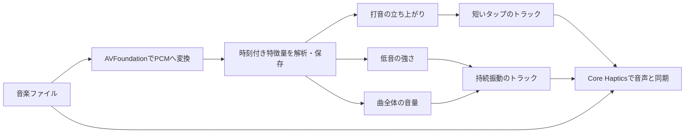

# 音楽から振動を生成するための調査と実装方針

> この文書は2026年10月5日の信号処理中心の初期調査。次世代の生成方式は、2026年10月7日の[音楽を理解して振動パートを編曲する設計](HAPTIC-ARRANGEMENT-DESIGN.md)を参照する。新設計は実装前であり、現在のアプリの操作は[使い方](MUSIC.md)に記載している。

調査日：2026年10月5日。対象：触感ラボ / HapticLab、iPhone SE（第3世代）、iOS 16以降。

公開されている実装、研究論文、公式仕様を現行コードと照合した。外部ツールの変換実行とiPhoneでの触感・同期の評価は未実施。以下の採用方式は設計判断であり、数値はこのプロジェクトの検証用初期値である。

## 採用する方式

自分のアプリで読み込める音楽ファイルを先に解析し、**低音の強弱から持続振動、打音の立ち上がりから短いタップ**を生成する。Swift、AVFoundation、Accelerate、Core Hapticsで構成する。初期モードは「ビート中心」「低音中心」「曲全体の強弱」「ミックス」とし、ミックスでは低音とタップを独立して調整する。

この判断は、音声特徴からイベント・強弱曲線を作る公開実装が存在し、Core Hapticsの表現に対応させやすいことによる。基本処理の参考は[haptifyの音声解析・AHAP生成](https://github.com/imedboumalek/haptify)。低音、立ち上がり、音量という特徴ごとの分岐と、その混合比は本プロジェクトで設計する。

初回は同梱の短い音源で同期と触感を比較し、その後「ファイル」からの読み込みと解析結果の保存へ進む。LINE MUSICについては下記の入力経路を別に検証する。

## 参考になるプロジェクトと研究

| 事例・一次資料 | 確認できた内容 | 今回の設計への反映 |
| --- | --- | --- |
| [Phazr：開発者によるApp Store説明](https://apps.apple.com/us/app/phazr/id1472113449) | iOSで音楽からリアルタイムに触覚を生成。ローカルの保護されていない音楽とマイク入力に対応。Apple Music・Spotifyのストリーミングは生音声へのアクセスがないため非対応と明記。 | 音楽ファイルを入口にする実例。マイク入力を将来の実験モードにできる。具体的な変換アルゴリズムは説明からは分からない。 |
| [Meta Haptics Studio：公式ガイド](https://developers.meta.com/vr/documentation/unreal/unreal-haptics-studio-get-started/) | Windows/macOSで音声を解析し、触覚を生成・編集できる。iOS向けにはTRANSIENTS.AHAPとCONTINUOUS.AHAPを出力する。 | 同梱音源の比較用パターンを作る候補。持続とタップを独立したトラックにする設計の参考。自分たちの生成結果とSE実機で比較する。 |
| [haptify：公開リポジトリ](https://github.com/imedboumalek/haptify) | Dart製の音声→AHAP/Android振動生成。RMS、エネルギーの立ち上がり、ゼロ交差率を用い、イベントと曲線を生成。READMEではMITライセンス。 | 軽量な信号処理の参考実装。今回のSwiftアプリにはAVFoundationとAccelerateで同等の基本処理を実装する案。音楽向けの低音分析とイベント密度調整を追加する。 |
| [Hwang・Lee・Choi, 2013：Real-time dual-band haptic music player](https://pubmed.ncbi.nlm.nih.gov/24808330/) | 低音・高音の2帯域から振動を作り、低音だけの方式より主観評価が良かったと報告。専用の2帯域アクチュエーターを使用。 | 音楽の情報を複数の特徴に分ける根拠。iPhoneでは単一のTaptic Engineに集約するため、この装置の性能をそのまま再現できるとは扱わない。 |
| [岡崎・栗林・梶本, 2016：周波数シフトによる音触覚変換](https://www.jstage.jst.go.jp/article/tvrsj/21/2/21_335/_article/-char/en) | 高周波成分を含む音に対して周波数シフトを用いる音触覚変換を評価。聴取体験の評価向上を報告。 | 高い音の情報も振動に利用できる。ただし、振動波形を自由に出力する方式の直接移植には出力装置の差がある。今回は音の明るさを触感の鋭さに対応させる設計候補とする。 |
| [Haynesら, 2021：FeelMusic](https://research-information.bris.ac.uk/en/publications/feelmusic-enriching-our-emotive-experience-of-music-through-audio/) | 音楽特徴と触覚の対応を専用装置で評価。振動の周波数と覚醒度には相関があり、快・不快との関係には個人差があった。 | 気持ちよさを一つの固定設定で決めず、強さ・密度・低音の比率を調整可能にする。この調整項目の選択は今回の設計判断。 |
| [Li・Seifi, CHI 2026：Sound2Hap論文](https://arxiv.org/html/2601.12245v3)・[公開コード](https://github.com/Iris1215/Sound2Hap) | 人の評価から音声→振動生成を学習するモデル。主な対象は環境音。評価に専用の振動装置と音・振動の順次再生を用いている。 | 学習方式の将来候補。楽曲の同時再生やSEでの優位性を示した研究ではないため、今回の基礎方式は軽量な信号処理とする。 |

各事例の触感や性能は装置・入力・評価方法に依存する。公開ソフトの出力も、今回の端末で受け入れられる形式と触感かを確認してから利用する。

## LINE MUSICなどの配信サービス

LINE MUSICの公式ヘルプは[アプリ・PCブラウザでの再生](https://help2.line.me/LINEMusic/ios/pc?contentId=10009612&lang=ja)と[アプリ内のダウンロード](https://help2.line.me/LINEMusic/?contentId=50000032)を説明している。今回調べた公式ヘルプ・LINE Developersの公開資料では、第三者のiOSアプリへ解析用PCM音声を渡すAPI、ダウンロード曲を一般音声ファイルへ書き出す機能、Music Hapticsへの対応声明を確認できなかった。公開情報の確認範囲による判断であり、非対応を公式に保証するものではない。

iOSでは、[他社アプリのファイルへのアクセスはサンドボックスによって制限される](https://support.apple.com/en-gb/guide/security/sec15bfe098e/web)。LINE MUSIC内の保存を、そのまま「ファイル」から読み込める音源として設計する根拠はない。アプリ同士の同時再生を許す設定だけでは解析用音声の取得方法は成立しない。

| 入力経路 | 実現性の判断 | 同期・実装上の条件 |
| --- | --- | --- |
| 音声ファイルをHapticLabで読み込み・再生 | 初期版の採用経路 | デコードできる保護されていないWAV・M4A・MP3等。音声と振動の再生時刻を自分たちで管理できる。 |
| 同じiPhoneのLINE MUSICを別アプリから直接解析 | 今回は成立する公開経路を確認できていない | 音声取得・再生位置の同期方法が必要。現行HapticLabは他アプリへの切り替え時に振動を停止する。 |
| PCや別のスマホのLINE MUSICをスピーカーで再生し、iPhoneのマイクで解析 | 実験候補 | Phazrにもマイク入力の実例がある。騒音、部屋の響き、振動音のマイク混入、解析遅延を検証する。イヤホン内の音はこの経路で取得できない。 |
| Windowsで再生音を取得し、特徴量をiPhoneへ送信 | 追加調査候補 | Microsoftの[WASAPI loopback](https://learn.microsoft.com/windows/win32/coreaudio/loopback-recording)は出力音声を取得できるが、保護された音声は取得できない場合がある。LINE MUSICでの可否、ネットワーク遅延・ばらつきの実測が先に必要。 |

マイク経路は音楽サービスの音声APIを必要としない実験案になる。ただし音を聴いた後で処理するため、ファイルの先行解析より同期の条件が厳しい。初期版とは別の検証とする。

## Apple標準のMusic Hapticsとの関係

Apple標準の「ミュージックの触覚」は、今回のSE（第3世代）では利用できない。Appleの[公式プレイリスト説明](https://music.apple.com/us/playlist/haptics-beats/pl.2757011680024a8388a646507d1e66b1)は、iOS 18以降のiPhone 12以降を対象とし、SE第3世代を除外している。

Music Hapticsの公開機能は[既知の音楽にApple生成の触覚トラックを組み合わせるもの](https://developer.apple.com/documentation/Updates/Accessibility)。[ISRCを指定して触覚トラックの有無を調べるAPI](https://developer.apple.com/documentation/mediaaccessibility/mamusichapticsmanager/checkhaptictrackavailabilityformedia%28matchingcode%3Acompletionhandler%3A%29)がある。任意の音声ファイルをAHAPへ変換する汎用APIとしては使えない。

一方、Core Hapticsは独自の触覚と音声を再生する仕組みで、Appleは[独自音声と触覚を組み合わせるサンプル](https://developer.apple.com/videos/play/wwdc2021/10278/)を公開している。今回はこちらを使い、実行時に`supportsHaptics`と`supportsAudio`を確認する。

## 解析と触覚への対応

以下の数値は採用方式を検証するための提案で、論文の推奨値やiPhoneで検証済みの最適値ではない。

| 処理 | 初期設定・方針 |
| --- | --- |
| デコード | AVFoundationでPCMを読み、分析用は44.1 kHzに統一。元の再生音声の品質を分析設定によって下げない。全曲のPCMをメモリーへ保持せず、順次処理する。 |
| ステレオ | チャンネルごとにエネルギーを算出して平均する。位相が逆の左右を単純加算したときに低音が消える問題を避ける。 |
| 分析窓 | Hann窓2048サンプル（約46 ms）、441サンプル（10 ms）ずつ進める。AccelerateのFFTを使う。[Appleによる窓処理の説明](https://developer.apple.com/documentation/accelerate/reducing-spectral-leakage-with-windowing)。 |
| 曲全体の強弱 | RMSから音量の包絡線を作る。無音を除いた分布を基準に圧縮・正規化し、静かな箇所の過剰な増幅を抑える。完全無音では出力をゼロにする。 |
| 低音 | 最初は40〜200 Hzの帯域エネルギーを利用。曲に合わせた正規化とアタック・リリースによる平滑化を行い、弱めの持続振動へ変換する。 |
| 打音 | スペクトルの増加量（spectral flux）と音量の増加を組み合わせ、局所的な閾値を超えるピークを採る。小さいピークを捨て、タップの最短間隔を最初は100 msにする。 |
| 触感の鋭さ | 周波数重心を参考にし、低音寄りでは柔らかく、高音寄りでは鋭くする。スペクトルからの対応は触感設計の仮説として比較する。 |
| 密度と余裕 | 持続振動の強さに余裕を残し、タップを感じ取れるか確認する。滑らかに強度を上下させ、連続した強い振動になった場合は感度・強さを下げる。 |

「ビート中心」の初期実装は打音の立ち上がり検出である。BPMに沿った拍位置の推定やドラムの分離とは異なる処理なので、正確な拍追跡が必要なら別途追加する。低音帯域にもベース以外の楽器が入り、立ち上がりにも歌声が含まれる。誤反応の実測を踏まえて特徴の重みを調整する。

時刻はサンプル位置から秒へ換算して保存し、分析窓の中心と端の違いを明示する。デコードの開始時刻、圧縮音声の先頭の遅延、平滑化の遅れも、再生に使う音声との比較で確認する。

調整項目は「全体の強さ」「タップの密度」「低音の強さ」「鋭さ」「同期の補正」。特徴量を保持しておけば、密度や混合比の変更に対して音源からのFFT解析を繰り返す必要を減らせる。

## Core Hapticsでの再生設計

初回の同期確認は15〜20秒の小さなWAV音源を使い、Core Hapticsへ登録した音声と、タップ・持続の各プレーヤーを同じエンジンの未来の時刻で開始する。初期の準備時間は150 msを候補とし、端末で調整する。Core Hapticsの音声・振動同期と動的制御の基本は[Introducing Core Haptics](https://developer.apple.com/videos/play/wwdc2019/520/)を参照する。

**タップと持続振動は別のパターンプレーヤーで管理する。** Appleの[AHAP仕様](https://developer.apple.com/documentation/corehaptics/representing-haptic-patterns-in-ahap-files)では、動的パラメーターはパターン全体のイベントに作用し、強度制御は乗算になる。同じプレーヤーに入れて低音用の強度曲線を設定すると、タップにもその制御がかかり、低音の弱い瞬間に打音まで弱くなる。低音の曲線を持続トラックへ限定し、タップには打点ごとの強度を指定する。複数トラックも一つのTaptic Engineから出力されるため、合成時の触感を実機で確かめる。

全曲再生へ拡張するときは、音声をAVAudioEngine等で再生し、触覚を準備した区間ごとに供給する。音声のホスト時刻とCore Hapticsの`currentTime`の対応を取得し、曲の経過時刻から両方を予約する。UIタイマーで各タップを発火させる方式は同期の基礎に使わない。初期の区間長は8〜20秒を候補とし、境界前に次を準備する。

一時停止・シークでは音声と触覚を同じ曲位置へ移す。シーク後は持続振動の途中からの再開も必要になる。エンジンのリセットや音声経路変更後は時刻の対応を取り直す。Bluetooth出力は音の到着が遅れる可能性があるため、本体スピーカー・有線出力から確認し、出力経路ごとの補正はその後に評価する。

停止と中断は曲全体を一つのセッションとして管理し、音声・持続・タップを一緒に停止する。曲を変更したら世代番号を更新し、前の曲の完了通知が新しい曲を停止しないようにする。区間プレーヤーの終了は全曲の終了とは別に扱う。初期版は前面での利用とする。[Appleの準備ガイド](https://developer.apple.com/documentation/corehaptics/preparing-your-app-to-play-haptics)にも、アプリの中断・停止に対する処理がある。

## 現行コードに必要な拡張

| 現在の構成 | 音楽対応の方針 |
| --- | --- |
| `HapticController.swift`は`playsHapticsOnly = true`、プレーヤーは一つ | 音楽セッション用に複数プレーヤーと音声の管理を追加。最初の短い音源では音声も扱うエンジンを使う。既存の見本との相互停止を統合する。 |
| `HapticPatternSpec`はパターン全体が30秒以内、256イベント以内 | これはアプリ独自の制限。音楽全体のモデルと再生区間を設け、全曲を一つの見本へ押し込まない。無音区間も表現する。 |
| 一つの曲線は2〜16点 | 密な包絡線を適切な誤差で簡略化し、続く時間区間の曲線へ分割する。境界の値を一致させる。 |
| `HapticLabApp.swift`は非アクティブ時に`suspend()` | 音楽の音声も停止対象へ含める。同じ端末のLINE MUSICへ切り替えて独自振動だけ継続する機能は初期設計に含めない。 |
| お気に入りと調整値の保存 | 音源ID、解析方式のバージョン、分析の設定、時刻付き特徴量、生成トラック、ユーザー設定を分けて保存する。 |

Core Hapticsの[一つの持続イベントの上限は30秒](https://developer.apple.com/documentation/corehaptics/chhapticevent/eventtype/hapticcontinuous)。これは曲全体が30秒までという意味ではない。また、[パラメーター曲線の16点制限と連続した曲線への分割](https://developer.apple.com/documentation/ios-ipados-release-notes/ios-ipados-13_1-release-notes)はAppleのリリースノートで説明されている。現在のSDKと対象OSで生成パターンを読み込んで確認する。

## 保存と読み込み

ユーザーが選んだ音源をアプリ内で管理できるコピー、または許可された参照として保持する。ファイル名だけをキャッシュキーにせず、内容のハッシュと解析バージョン・設定を使う。音源の差し替えと解析方式の変更で古い結果を無効にする。

保持する特徴は、時刻、全体音量、低音エネルギー、立ち上がり強度、音の明るさ。数分の曲でもPCMを丸ごと保存するより小さくできる。解析はUIを止めず、キャンセル・進捗・途中失敗を扱う。曲の長さ・メモリー使用量の実測から、初期版の読込上限を決める。

生成物は内部の時刻付きトラックを基本とし、AHAPは外部ツールとの比較・受け渡しに利用する。AHAPは解析機能ではなくパターン記述形式なので、[Appleのファイル再生サンプル](https://developer.apple.com/documentation/corehaptics/playing-a-custom-haptic-pattern-from-a-file)だけでは音源の自動変換は行われない。

## 実装順序と検証の区切り

1. **短い音源で比較する。** 打点と低音の区間が分かる15〜20秒の音源を用意。手設計、haptifyまたはMetaの生成物、今回の自動生成のうち利用できるものを、SE実機で同じ音源に合わせて比較する。
2. **信号処理を固める。** まずタップのみ、低音のみ、音量のみ、ミックスを実装。打点のずれ、鳴り続ける区間、振動が強すぎる箇所を特定して、設定を選ぶ。
3. **ファイル読込と保存を追加する。** WAV・M4A・MP3でデコードの可否と音声・触覚の位置を確認。再生時のキャッシュ利用と、設定変更時の再生成を検証する。
4. **全曲の再生操作を追加する。** 区間境界、シーク、一時停止、曲変更、中断、音声経路変更を検証する。
5. **LINE MUSIC向けの実験を行う。** PC等のスピーカー→iPhoneマイクを先に確認。Windows連携は音声取得の可否が確認できてから設計する。

自動検証には、無音、一定の低音、既知時刻の打音、左右が逆位相の音、先頭に無音がある圧縮音源を使う。打点時刻の誤差は最初の目標を30 ms以内とし、無音で誤振動がないこと、区間境界で欠落・二重再生がないことを確認する。この30 msは本プロジェクトの目標値であり、万人の快適さを保証する知覚閾値ではない。

実機評価では同じ区間を順序を入れ替えて比較し、「音と合う」「打音が分かる」「気持ちよい」「長く持つと疲れる」を記録する。本体スピーカーと有線出力で同期を確認した後、Bluetoothも評価する。測定器が使える場合は音声と端末の振動開始の差を計測し、主観評価と分けて報告する。

実機で未確認の事項は、ミックス時の触感、設定の適量、音声経路ごとの遅延、全曲再生の区間境界、電池・発熱、マイクへ振動音が混入する程度、WindowsでのLINE MUSIC音声取得である。これらを次の試作の検証項目として残す。
