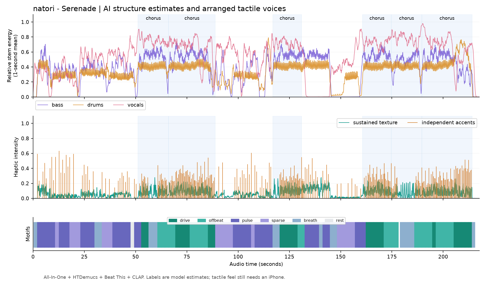

# リズム改善後の全曲検証

2026-10-07、`arrangement-3.3`。指定された [なとり「セレナーデ」のMV](https://www.youtube.com/watch?v=gNg2Qw5R-Q4) を再取得し、このPCで全モデルを再実行した。保存済みグラフだけを再編曲する試験ではなく、iPhoneと共通の認証付きHTTP APIで取得から解析・編曲・AHAP出力まで検証した。

参照情報は [修正前の監査](SERENADE-REFERENCE.md)。実測値は [metrics](arrangement-3.3/serenade-metrics.json)、拍の検証は [rhythm-checks](arrangement-3.3/serenade-rhythm-checks.json)。初回のモデル取得時間は含まない。

## 結果

| 項目 | 改善後 |
| --- | --- |
| 音源の長さ | 217.74秒 |
| テンポ推定 | **136.998 BPM**。参照137 BPMとの差は0.002 BPM |
| 解析・編曲 | 約43.97秒 |
| APIのジョブ完了まで | 約45.02秒 |
| 同じ音源のキャッシュ再利用 | 約3.44秒 |
| 編曲 | 125生成区間、275アクセント。持続とアクセントは独立プレーヤー用 |
| AHAP | 28クリップ、55ファイル。アクセント時刻の往復一致と持続曲線の分離を確認 |
| 拍のモデル間整合性 | 一対一F1 95.36%、precision 94.22%、recall 96.53% |
| 小節頭のモデル間整合性 | 一対一F1 92.49%。正答率を意味しない |

前回の136 BPMは短い拍間隔の整数最頻値だった。改善後は連続する複数拍の時刻を直線近似し、残差の大きい区間を除いてテンポを集計する。137 BPMをコードへ固定したわけではない。観測された拍時刻を編曲へ使用し、実際のテンポ変化も保持する。

## 重複拍と小節の信頼判定

別モデルの拍時刻と局所周期の裏付けがある場合だけ、近すぎる四分音符の拍候補を取り除く。重複した細分音符が実音に存在していても、ドラムのオンセット情報は残し、表現用に使用する。両モデルが同じ曖昧な重複を持つ場合は無理に削除せず、小節の信頼判定を落とす。

| 区間（MV秒） | 改善前 | 改善後 |
| --- | ---: | ---: |
| 44.14–45.90 | 5拍、信頼あり | **4拍、信頼あり** |
| 45.90–47.66 | 5拍、信頼あり | **4拍、信頼あり** |
| 162.38–164.16 | 5拍、信頼あり | **4拍、信頼あり** |
| 164.16–165.90 | 6拍、信頼あり | **4拍、信頼あり** |

これらは修正前に確認した4つの誤検出例。全曲の人手による正解注釈はなく、全125区間が正しいと保証する結果ではない。6拍・3拍・2拍の区間は残しており、全曲を4/4へ矯正していない。

一対一の照合により、余分な拍がprecisionを下げ、検出漏れがrecallを下げる。小節の信頼判定は局所F1、小節頭の一致、拍の連続性、小節長と周期の整合性を使う。信頼が足りない区間は持続中心のフレーズへ切り替える。

## シャッフル

ドラムのオンセットから各区間の16分音符の跳ねを推定する。最低観測数と集中した支持を必要とし、根拠が足りない場合の分割位置は中立の0.5とする。支持のある場合は細分音符をずらし、四分音符・8分音符の拍格子を動かさない。配置候補の評価と最終出力の両方に同じ補正を使用する。

今回の音源では88.86–116.89秒で`split = 0.6844`、14観測、支持率約0.711を得た。概ね2:1に近い16分シャッフルの候補で、原曲全体の正解比率を測定したという意味ではない。他区間は根拠不足として補正していない。サビ境界の人手検証も未完了。

## 検証と配布

既存のHTTP API・解析・編曲テストに、量子化された137 BPM、他テンポ、重複拍、両モデルで一致する曖昧な重複、2/3/5/7拍子、テンポ変化、直線的な16分音符とシャッフル、弱い根拠での補正抑制の試験を加えた。

全曲のAPIスキーマ、出力強度と音符間隔、無音区間、AHAPの往復、保存後の再読み込み、キャッシュ再利用、一時音源・ステムの削除を確認した。解析パイプラインのバージョンを更新し、修正前のキャッシュを新規解析に流用しない。

ネイティブのビルドとテストはGitHub ActionsのmacOS環境で行う。該当ビルドの結果・ソースコミットは成果物の`BUILD-INFO.json`と`TEST-SUMMARY.json`に記録される。iPhone実機での触感は別途確認が必要。
