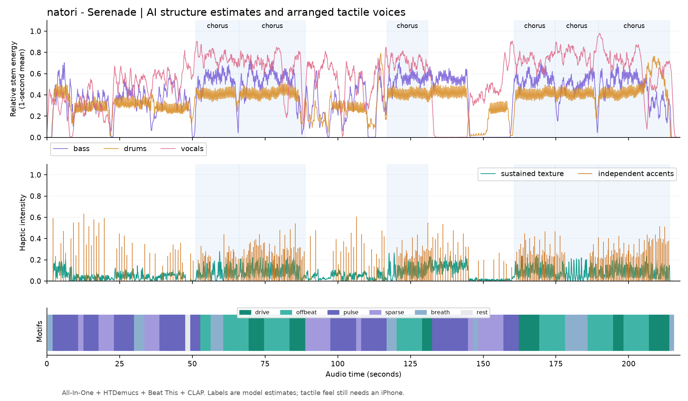

# 指定曲による音楽AI・振動編曲の検証

後続の [参照情報とリズム監査](SERENADE-REFERENCE.md) では、公開採譜資料と拍時刻の再計算から **137 BPMを参照値** とした。以下の136 BPMは当時のモデル出力を記録した値。拍の重複による5拍・6拍の誤検出も見つかったため、126小節は生成区間数として扱い、モデル間一致率を正答率とは解釈しない。実際の拍子変更の位置とサビ境界は未確認。

2026-10-07、Windows PC / NVIDIA RTX 3050（VRAM 8 GB）で、指定された [natori - Serenade](https://www.youtube.com/watch?v=gNg2Qw5R-Q4) の全曲を実際に取得・解析・編曲した。短い疑似音源だけの試験ではなく、iPhoneが使うHTTP APIと同じジョブ経路を実行した。

機械可読の結果は [serenade-metrics.json](serenade-metrics.json)、再実行スクリプトは [verify-arrangement.py](../../pc-server/verify-arrangement.py)。音声・分離音源は検証資料に含めない。

## 実測結果

| 項目 | 結果 |
| --- | --- |
| 曲の長さ | 217.74秒 |
| 処理時間 | 46.718秒。初回のライブラリ・モデル取得は含まない |
| APIでジョブ完了まで | 48.016秒 |
| 同じ音源のキャッシュ再利用 | 4.375秒。音声の一致確認のため再取得・デコードを行う |
| 分離 / 構造 / 拍 / 特徴量 / 雰囲気 | 11.984 / 14.015 / 1.891 / 2.890 / 4.360秒 |
| PyTorchの最大GPU割当量 | 755.708 MiB。GPU全体のメモリ使用量ではない |
| 拍のモデル間一致 | 96.53%。70 ms以内の一致で評価 |
| 小節頭のモデル間一致 | 95.12%。70 ms以内の一致で評価 |
| テンポ推定 | 136 BPM。編曲は一定BPMの固定格子ではなく検出した拍を使用 |
| 編曲 | 126小節、278アクセント、独立した持続レイヤー |
| AHAP | 28クリップ、持続／アクセント計55ファイル。別途manifest |

パイプライン `arrangement-3.2`、固定乱数seed `20261007`。モデルはHTDemucs、All-In-One Harmonixの8モデル、Beat This final0、CLAP HTSAT unfused。[版と出典](../PC-SERVER.md#モデルの出典と固定した実装)。重みのSHA-256もmetricsに記録した。

## 推定した展開と編曲

サビ候補のまとまりは51.20〜88.86秒、116.89〜130.91秒、160.69〜214.13秒。歌の区間ではpulse / sway系、サビではdrive系を選び、サビの再来で同じモチーフ系統を使った。144.91〜160.69秒は展開、130.91〜144.91秒は間奏と推定した。

モチーフはpulse 39、offbeat 32、sparse 19、drive 18、breath 17、rest 1小節。歌の強さ・楽器のアタック・無音・連続刺激の負担を評価し、小節ごとに配置を探索する。推定の弱い区間は密度を控える。

上段は楽器ごとに正規化した相対エネルギーを約1秒で平滑化した表示。楽器間の絶対音量比較ではない。中央は実際に書き出した持続強度とアクセント。下段は小節ごとのモチーフ。薄青の範囲はサビ候補。

56〜64秒の [持続AHAP](serenade-56s-bed.ahap) と [アクセントAHAP](serenade-56s-accents.ahap) を保存した。この2つを別プレーヤーへ載せて同時開始するとレイヤーを再現できる。音楽の音声は含まない。[AHAPの説明](../AHAP.md)。

## 確認したこと

- 指定曲全体について、楽器分離・構造・拍・雰囲気の全モデル推論を完了。
- 認証付きHTTP APIの結果をOpenAPIのスキーマで検証。
- 時刻・強度が有限値で順序通り、生成レベルが上限内、無音フレームの持続がゼロ。
- 生成AHAPの時刻を全曲へ戻すとアクセントが一致。持続の制御曲線をアクセントAHAPへ混ぜていない。
- サーバー状態を作り直しても保存した振動を読み込める。
- 同じ音源・モデル・設定の再実行で保存結果を再利用。
- 一時取得音源・分離音源・スペクトログラムを処理終了後に削除。

PC側の単体・HTTPテストは27件成功。拍子変更・テンポ変化、拍モデルの不一致、無音、上限、AHAPの分離、キャッシュの更新条件と作業フォルダー再利用も検証した。Xcodeプロジェクトの28ソース・テスト登録と既存パターン・画像の構成チェックも成功。

不具合として、Windowsで進捗ファイルの読み取り中に置換する競合と、Node有効時のYouTube取得403を実データで見つけて修正した。前者は短い再試行、後者は標準クライアントを先に使い必要時だけNodeへ切り替える。

## 残る確認

手動の正解区間を用意していないため、サビの正答率は測定していない。モデルのconfidenceや2モデルの一致率を正答率と解釈しない。CLAPの6記述比較は音の雰囲気の候補で、歌詞や作者の意図の理解は対象外。

Xcodeビルド、追加したSwift単体／UIテストの実行、iPhoneでの触感・レイヤー合成・AHAPのネイティブ再生は未確認。Windowsからこれらが成功したとは判断できない。CPU推論とmacOS / LinuxのAI導入も未測定。

次の実機確認は、同時レイヤーのクリックが持続に埋もれないか、51秒付近と116秒付近でモチーフの再来を感じるか、歌の区間で振動が過剰にならないか、一時停止・シーク・中断で同期と停止が保たれるかを確認する。[設計](../HAPTIC-ARRANGEMENT-DESIGN.md)には初期実装と将来の拡張を分けて記載した。
